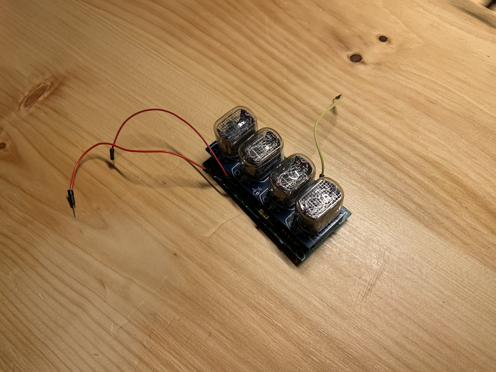
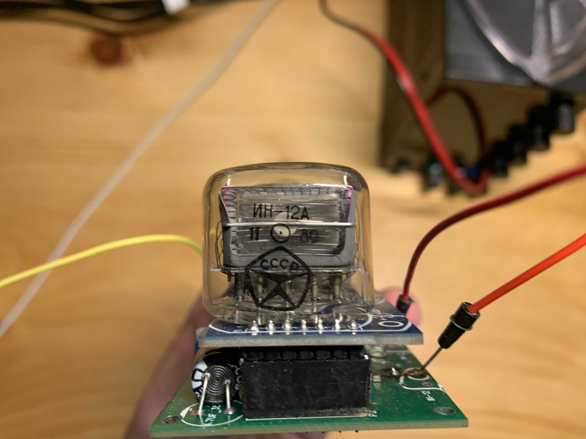
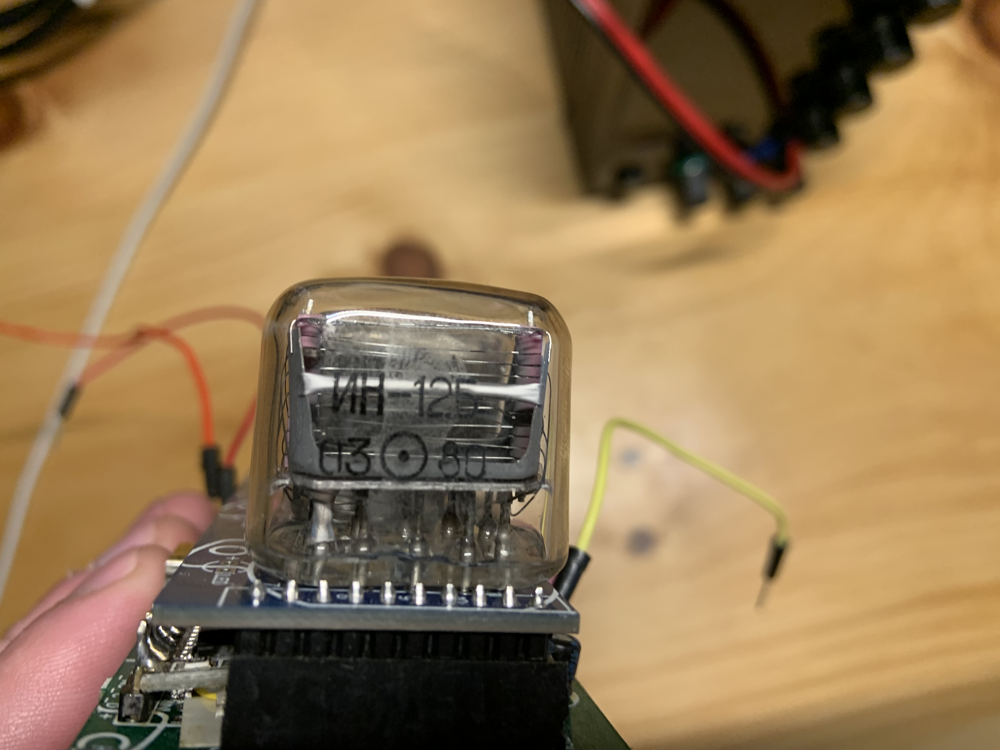
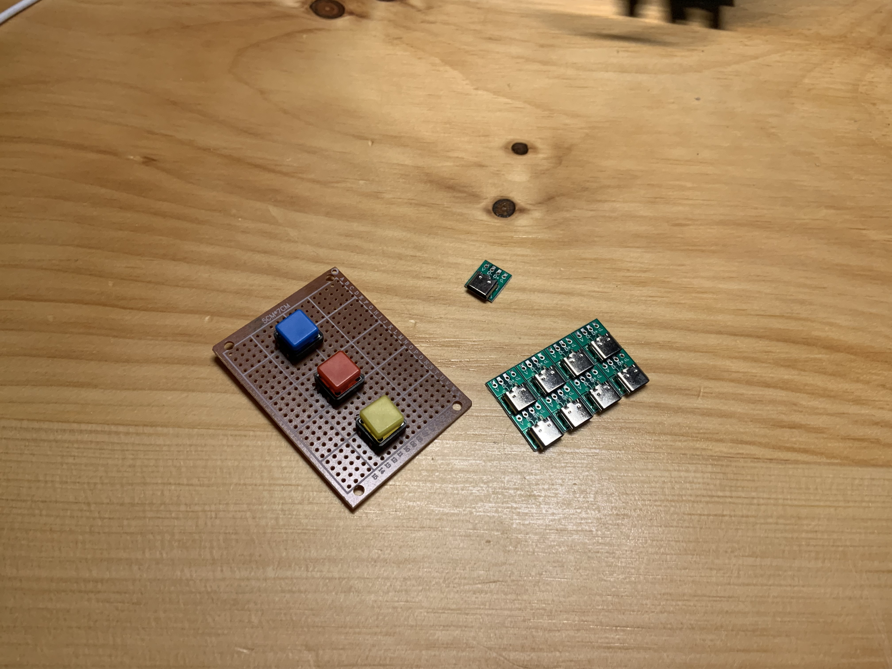
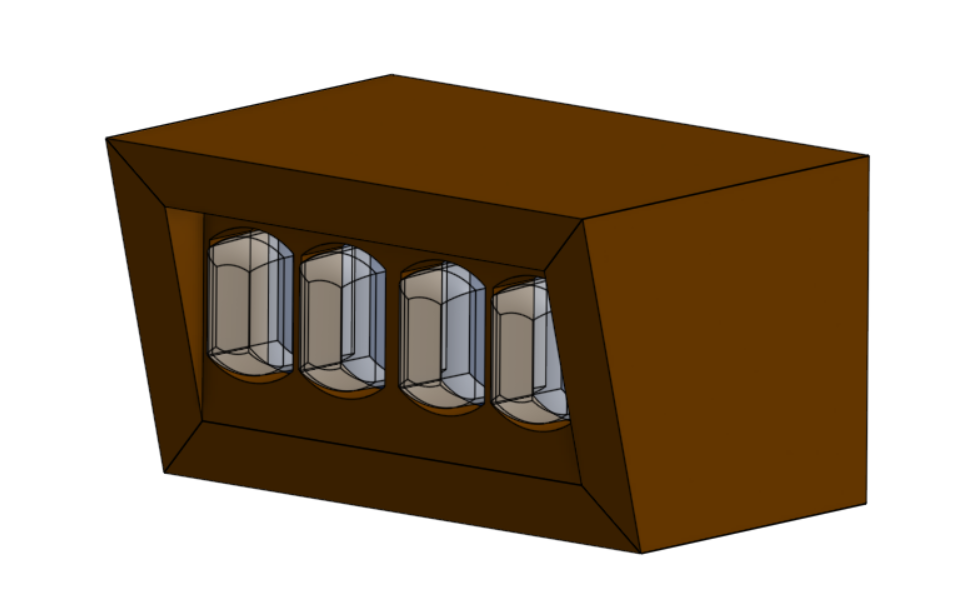
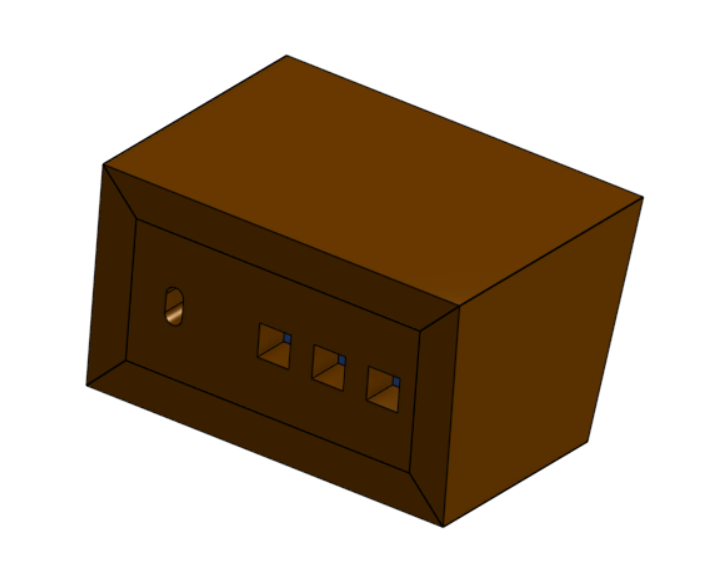

# Nixie Tube Clock Case (NTCC24), R001

I have a Nixie tube clock with what seem to be genuine soviet Nixie tubes installed in them. Unfortunately, it is no longer with its original case:

Try to ignore the test jumpers

Said tubes:

I think I'll try and make a new case out of wood which will nice support the clock, its 3 buttons (set, +, -), and power connector. I've switched out the generic push buttons that were attached with much wider ones that aren't as painful to press for longer periods of time (done if holding +/- if the clock is very off). I've also switched the original MicroB connector for a USB-C connector as it looks nicer/is becoming more ubiquitous.

Buttons and connectors in question:

Dimnesioned the clock as best I could and built a wooden case around it in onshape. Trying to use 0.5x6" stock for the whole thing but the clock dimensions make it a little tricky.

The clock is mostly constrained by the dimensions of the case. There is a channel across the bottom piece which the back-most PCB rides in. The front and back pieces also slide in via channels. Here are my hopefully clear enough drawings:

Hopefully I'll have some work on this done soon